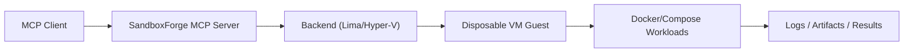

# SandboxForge MCP

SandboxForge MCP is an MCP server for VM-first isolated execution with workspace-aware tooling.

It supports multiple virtualization backends:
- Lima on macOS and Linux
- Hyper-V on native Windows

Inside each VM, SandboxForge can bootstrap Docker/Compose workloads, run commands, manage optional MySQL/Redis services, and collect artifacts with lease-based lifecycle control.

## Table of Contents
- [Why SandboxForge MCP](#why-sandboxforge-mcp)
- [When To Use This (vs Alternatives)](#when-to-use-this-vs-alternatives)
- [Primary Workflows](#primary-workflows)
- [Isolation Model](#isolation-model)
- [OS Support Matrix](#os-support-matrix)
- [Architecture](#architecture)
- [Requirements](#requirements)
- [Quick Start (Local Host Runtime)](#quick-start-local-host-runtime)
- [Connect Your MCP Client](#connect-your-mcp-client)
- [Hello World (First End-to-End Flow)](#hello-world-first-end-to-end-flow)
- [Tool Surface](#tool-surface)
- [Configuration](#configuration)
- [Environment Variables](#environment-variables)
- [Development](#development)
- [Security Model and Non-Goals](#security-model-and-non-goals)
- [Troubleshooting and Error Rectification](#troubleshooting-and-error-rectification)
- [Migration Notes (v1 Breaking)](#migration-notes-v1-breaking)
- [Related Docs](#related-docs)
- [License](#license)

## Why SandboxForge MCP
- VM-first isolation for execution that should not run directly on your host
- Workspace-aware lifecycle orchestration (create, sync, run, collect, destroy)
- Docker/Compose runtime inside disposable guests
- Backend-neutral contract across macOS/Linux/Windows
- Designed for automation flows and MCP clients, not manual VM administration

## When To Use This (vs Alternatives)
Choose SandboxForge MCP when you need a tool-driven isolation layer for automated workflows.

| Option | Best For | Isolation Boundary | Tradeoff |
|---|---|---|---|
| SandboxForge MCP | MCP-driven, disposable VM automation with Docker inside | VM guest | More setup than plain Docker |
| Plain Docker on host | Fast local container loops | Container on host kernel | Weaker host separation |
| Dev Containers | IDE-focused local development | Container on host kernel | Not lease/task orchestration focused |
| GitHub Codespaces | Cloud dev environments | Remote VM/container | Requires cloud workflow and cost |
| Firecracker-based sandboxes | High-density microVM infra | MicroVM | Different operational model/tooling |

## Primary Workflows
1. Disposable integration test sandbox:
   - `create_instance` -> `prepare_workspace` -> `run_command` -> `collect_artifacts` -> `destroy_instance`
2. Isolated execution for untrusted build/test steps:
   - Sync repo in, run build/test tools in guest, copy only outputs back
3. Dockerized app prep with bundled services:
   - `prepare_workspace` with infra options -> `docker_compose up` -> run tests with injected DB/Redis env

## Isolation Model
SandboxForge is VM-first isolation, not Docker-only host isolation.

- Isolation boundary: disposable VM guest
- Runtime inside boundary: Docker/Compose
- Goal: reduce host pollution and improve isolation for task execution

## OS Support Matrix
Status as of March 25, 2026:

| Host OS | Status | Backend | Notes |
|---|---|---|---|
| macOS | Supported | Lima | Default `vm.vm_type = "vz"` |
| Linux | Supported | Lima | Default `vm.vm_type = "qemu"` |
| Windows (native) | Supported | Hyper-V | Requires Hyper-V + `HYPERV_BASE_VHDX` + OpenSSH client |
| Windows (WSL2-hosted server runtime) | Not supported in v1 | N/A | Run server natively on Windows |

Unsupported hosts or missing prerequisites return `BACKEND_UNAVAILABLE`.

## Architecture


High-level runtime flow:
1. Client calls a tool via stdio or Streamable HTTP
2. `LeaseService` validates config and lifecycle constraints
3. `LeaseStore` persists lease/task state in SQLite
4. Backend performs VM lifecycle operations
5. Runtime helpers run commands and container workloads in-guest
6. Sweeper expires stale leases by TTL

Key modules:
- `src/lima_mcp_server/server.py`: MCP transport and tool registration
- `src/lima_mcp_server/service.py`: orchestration and response shaping
- `src/lima_mcp_server/backend/lima.py`: Lima backend adapter
- `src/lima_mcp_server/backend/hyperv.py`: Hyper-V backend adapter
- `src/lima_mcp_server/backend/factory.py`: backend selection (`auto|lima|hyperv`)
- `src/lima_mcp_server/workspace_config.py`: config parsing/validation
- `src/lima_mcp_server/runtime.py`: Docker/Compose command builders
- `src/lima_mcp_server/db.py`: SQLite persistence

## Requirements
- Python `3.11+`
- [`uv`](https://github.com/astral-sh/uv)
- Host virtualization prerequisites:
  - macOS/Linux: `limactl` in `PATH`
  - Windows: Hyper-V cmdlets + `ssh`/`scp`

Minimum default VM shape:
- `cpus = 1`
- `memory_gib = 2.0`
- `disk_gib = 15.0`

## Quick Start (Local Host Runtime)
```bash
uv sync --extra dev
uv run sandboxforge-mcp-server
```

If your shell cannot resolve the script entrypoint:
```bash
uv run python -m lima_mcp_server.server
```

Using Make:
```bash
make setup
make run
```

## Connect Your MCP Client
### Option A: Local stdio (recommended for development)
Use this in your MCP client config:

```json
{
  "mcpServers": {
    "sandboxforge": {
      "command": "uv",
      "args": ["run", "sandboxforge-mcp-server"],
      "cwd": "/absolute/path/to/SandboxMCP"
    }
  }
}
```

If your client still reports `Failed to spawn sandboxforge-mcp-server`, use:

```json
{
  "mcpServers": {
    "sandboxforge": {
      "command": "uv",
      "args": ["run", "python", "-m", "lima_mcp_server.server"],
      "cwd": "/absolute/path/to/SandboxMCP"
    }
  }
}
```

### Option B: Streamable HTTP
Run server with HTTP enabled (default) and connect to:
- URL: `http://127.0.0.1:8765/mcp`

Client config example:

```json
{
  "mcpServers": {
    "sandboxforge-http": {
      "transport": "streamable-http",
      "url": "http://127.0.0.1:8765/mcp"
    }
  }
}
```

Notes:
- `http://127.0.0.1:8765/` returns `404` by design
- `http://127.0.0.1:8765/mcp` is the MCP endpoint

## Hello World (First End-to-End Flow)
After connecting your client, run this flow against a local workspace path:

1. `validate_workspace_config(workspace_root="/abs/path/to/workspace")`
2. `create_instance(workspace_root="/abs/path/to/workspace", auto_bootstrap=true, wait_for_ready=true)`
3. `prepare_workspace(instance_id="<id>", wait_for_ready=true)`
4. `run_command(instance_id="<id>", command="echo hello-from-sandbox && uname -a")`
5. `destroy_instance(instance_id="<id>")`

Expected success markers:
- `create_instance`: returns `instance_id` and backend details
- `prepare_workspace`: `runtime_ready = true`
- `run_command`: exit code `0` with command output

## Tool Surface
Core tools include:
- `create_instance`, `list_instances`, `destroy_instance`, `extend_instance_ttl`
- `validate_workspace_config`, `validate_image`
- `prepare_workspace`, `run_command`
- `copy_to_instance`, `copy_from_instance`, `sync_workspace_to_instance`, `sync_instance_to_workspace`
- `docker_build`, `docker_run`, `docker_exec`, `docker_logs`, `docker_compose`, `docker_ps`, `docker_images`, `docker_cleanup`
- `start_background_task`, `get_task_status`, `get_task_logs`, `stop_task`
- `collect_artifacts`

## Configuration
Workspace config file precedence (high -> low):
1. Request overrides
2. `<workspace>/.sandboxforge.toml`
3. `~/.config/sandboxforge-mcp/config.toml`
4. Built-in defaults

Legacy config files still supported:
- Workspace: `.orbitforge.toml`, `.lima-mcp.toml`
- Global: `~/.config/orbitforge-mcp/config.toml`, `~/.config/lima-mcp/config.toml`

Default VM config:
- `template = "template:docker"`
- `vm_type = "vz"` on macOS
- `vm_type = "qemu"` on Linux
- `vm_type = null` on other hosts

For schema/examples, see `docs/SETUP.md` and `src/lima_mcp_server/workspace_config.py`.

## Environment Variables
Core server:
- `MCP_HTTP_HOST` (default `127.0.0.1`)
- `MCP_HTTP_ALLOW_NON_LOOPBACK` (default `0`)
- `MCP_HTTP_PORT` (default `8765`)
- `MCP_ENABLE_HTTP` (default `1`)
- `LEASE_DB_PATH` (default `state/leases.db`)
- `MAX_INSTANCES` (default `3`)
- `DEFAULT_TTL_MINUTES` (default `30`)
- `MAX_TTL_MINUTES` (default `120`)
- `SANDBOX_SWEEPER_INTERVAL_SECONDS` (default `60`)

Backend selection:
- `SANDBOX_BACKEND` (`auto`, `lima`, `hyperv`; default `auto`)

Hyper-V backend:
- `HYPERV_SWITCH_NAME` (default `Default Switch`)
- `HYPERV_BASE_VHDX` (required for Hyper-V)
- `HYPERV_STORAGE_DIR` (default `state/hyperv`)
- `HYPERV_SSH_USER` (default `ubuntu`)
- `HYPERV_SSH_KEY_PATH` (optional)
- `HYPERV_SSH_PORT` (default `22`)
- `HYPERV_BOOT_TIMEOUT_SECONDS` (default `180`)

## Development
Run tests:

```bash
uv run pytest -q
```

Integration gates:
- `RUN_LIMA_INTEGRATION=1`
- `RUN_HYPERV_INTEGRATION=1`

## Security Model and Non-Goals
Trust model:
- Trusted: host operator, MCP server process, backend tooling
- Untrusted/less-trusted: workspace code and commands executed in guest VM

Threat model focus:
- Reduce direct host exposure from task execution
- Limit host pollution by running workloads in disposable guests
- Keep task lifecycle auditable via persisted lease/task records

Non-goals:
- Not a guarantee against guest-to-host kernel escape
- Not a replacement for hardened multi-tenant sandbox infrastructure
- Not a complete network isolation framework by default

## Troubleshooting and Error Rectification
### `Failed to spawn: sandboxforge-mcp-server`
- Run `uv sync --extra dev` in repo root
- Verify script: `uv run sandboxforge-mcp-server --help`
- Fallback entrypoint: `uv run python -m lima_mcp_server.server`
- Ensure client `cwd` points to this repo root

### `BACKEND_UNAVAILABLE`
- Confirm backend prerequisites for your host OS
- Check selected backend (`SANDBOX_BACKEND`)
- macOS/Linux: verify `limactl --version`
- Windows: verify `Get-Command New-VM`, `Get-Command New-VHD`, `ssh -V`

### Docker-hosted MCP runtime is not supported
- Run the MCP server directly on host OS (macOS/Linux/Windows native)
- Keep Docker usage inside guest VM workloads (`docker_*` tools), not as server host runtime

### HTTP endpoint confusion
- `GET /` returns `404` (expected)
- MCP endpoint is `/mcp`
- `406 Not Acceptable` on plain curl means endpoint is alive but expects MCP streamable HTTP headers

### Deprecated env var name used
- Replace `LIMA_SWEEPER_INTERVAL_SECONDS` with `SANDBOX_SWEEPER_INTERVAL_SECONDS`

## Migration Notes (v1 Breaking)
This release uses backend-neutral API naming.

Breaking changes from pre-v1:
- Tool rename: `lima_validate_image` -> `validate_image`
- Response/storage field rename: `lima_name` -> `backend_instance_name`
- Error code rename: `LIMA_COMMAND_FAILED` -> `BACKEND_COMMAND_FAILED`
- Env var rename: `LIMA_SWEEPER_INTERVAL_SECONDS` -> `SANDBOX_SWEEPER_INTERVAL_SECONDS`

## Example Workspace
For a copyable real workspace setup:
- `examples/sample-workspace/`
- `examples/sample-workspace/README.md`
- `examples/sample-workspace/.sandboxforge.toml`

## Related Docs
- Setup: `docs/SETUP.md`
- Project structure: `docs/PROJECT_STRUCTURE.md`
- Coding constraints: `docs/CODING_STANDARDS.md`
- Contributor guide: `CONTRIBUTING.md`
- Changelog: `CHANGELOG.md`
- Security: `SECURITY.md`
- Agent orientation: `AGENTS.md`

## License
MIT. See `LICENSE`.
